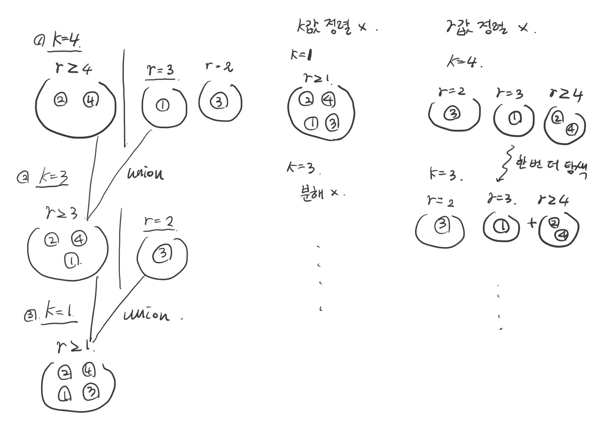

# 백준 15591번: MooTube(Silver)
https://www.acmicpc.net/problem/15591

## 목차
+ 풀이1 해설
+ 풀이2 해설
+ 풀이3 해설

## SOL 1: bfs 그러나 그래프 완전 탐색
[**전체 코드 링크**](https://github.com/sojungoh/algorithm-ps/blob/main/baekjoon/b-15591/case1.cpp)

처음 문제를 읽었을 때

`존은 N-1개의 동영상 쌍을 골라서 어떤 동영상에서 다른 동영상으로 가는 경로가 반드시 하나 존재하도록 했다.`

위 문장에서 스패닝 트리라는 것을 파악했고, 이는 그래프가 사이클을 형성하지 않는다는 뜻이므로 bfs를 이용해 구현해야겠다 생각했습니다.
다만 v(시작 정점)와 나머지 정점 간의 최소 usado를 구하는 것에 매몰된 나머지, v에서 모든 정점을 한 번씩 방문하며 정답을 도출했습니다.
이 풀이는 O(QN)의 시간 복잡도가 나오는데 다행히 Q와 N이 5000 이하의 값을 가져 시간 제한에 걸리지 않았고, 백준 채점 서버 상 456ms가 소요되었습니다.

<br>

## SOL 2: bfs 그러나 문제 조건을 활용해 시간을 단축
[**전체 코드 링크**](https://github.com/sojungoh/algorithm-ps/blob/main/baekjoon/b-15591/case3.cpp)

`존은 임의의 두 쌍 사이의 동영상의 USADO를 그 경로의 모든 연결들의 USADO 중 최솟값으로 하기로 했다.`

이 문제의 그래프는 스패닝 트리 구조이기 때문에 임의의 정점에서 특정한 정점으로 가는 경로는 하나밖에 없습니다.
따라서 bfs를 통해 그래프를 탐색하는 도중 k보다 작은 usado r을 만난다면 그 다음부터 방문하게 될 모든 동영상(정점)들은 k보다 작은 usado 값을 가지게 될 것입니다. 따라서 그 순간부터 더 이상 그래프를 탐색할 필요가 없습니다.

```c++
while(!que.empty()) {
        int curr = que.front();
        que.pop();

        if(visited[curr])
            continue;
        visited[curr] = true;
        ans += 1;

        for(auto [q, r] : g[curr]) {
            if(r < k)
                continue;
            que.push(q);
        }
    }
```
현재 방문한 정점에서 방문할 수 있는 정점들 중에서 두 정점 사이의 간선 비용(r)이 k보다 작다면 큐에 삽입하지 않음으로써
비용을 줄일 수 있습니다. 이 풀이는 백준 채점 서버에서 200ms의 시간이 소요되며 실제로 1번 풀이에 비해 시간이 단축되었습니다.

<br>

## SOL 3: disjoint set을 이용한 새로운 문제 접근
[**전체 코드 링크**](https://github.com/sojungoh/algorithm-ps/blob/main/baekjoon/b-15591/case2.cpp)

SOL 2는 간선 비용(r)이 k보다 작을 경우 예외처리함으로써 모든 간선을 탐색할 필요가 없어졌지만 그럼에도 결국에는 쿼리마다 중복해서 정점과 간선을 탐색해야 한다는 단점이 있습니다.

SOL 3의 disjoint set을 이용하면 중복없이 한 번의 간선 탐색만으로 문제를 해결할 수 있습니다.

그래프를 간선 비용이 큰 순(내림차순)으로 정렬하고 쿼리를 k값이 큰 순(내림차순)으로 정렬한 뒤 union-find를 수행하는 과정을 그림으로 나타내면 다음과 같습니다.

<br>



주어진 예제에 맞춰 쿼리는 k = 4, 3, 1 순으로 정렬되어 있고 그래프는 r = 4, 3, 2 순으로 정렬되어 있다고 해보겠습니다.
```c++
for(auto [k, v, idx] : query) {
    while(count < N - 1) {
        auto [r, p, q] = graph[count];
        if(r >= k) {
            union_parent(parent, p, q);
            ++count;
        }
        else
            break;
    }
    int p = find_parent(parent, v);
	ans[idx] = -(parent[p] + 1);
}
```
처음 반복문에서 k=4이고 r=4이므로 union 과정을 수행합니다.
돌아와서 count값이 하나 증가되고 r=3이라 k=4보다 작기 때문에 while문을 빠져나오고 정답을 기록하게 됩니다.
이 과정을 반복하면 되는데 왜 쿼리와 그래프를 각각 k와 r값에 대하여 내림차순 정렬해야 할까요?

만약 쿼리가 k값에 대해 내림차순 정렬되어 있지 않다면 현재 탐색하고자 하는 k보다 작은 k값이 앞에 있었을 시, 더 이상 올바른 union을 수행할 수 없어 한 번의 간선 탐색만으로는 정답을 구할 수가 없습니다.

만약 그래프가 r값에 대해 내림차순 정렬되어 있지 않다면 각 쿼리에 대해 모든 r값을 탐색해야 하므로 역시 한 번의 간선 탐색만으로는 정답을 구할 수가 없습니다.

이 풀이는 백준 채점 서버에서 4ms의 시간이 소요되며 1번과 2번 풀이에 비해 상당한 시간이 단축되었습니다.

<br>

## C++의 대괄호를 이용한 구조적 바인딩
구조적 바인딩은 레퍼런스와 같이 객체에 대한 별명이 됩니다.
차이가 있다면, 꼭 레퍼런스 타입일 필요가 없다는 것입니다.
아래 케이스를 살펴보겠습니다.

### CASE: 배열 바인딩하기
```c++
int a[2] = {1, 2};
auto [x, y] = a;
auto& [xr, yr] = a;
```

바인딩이 레퍼런스 타입이 아닌 경우, e[2]라는 새로운 배열이 생성되고 a가 e로 복사됩니다.
x는 e[0]의 레퍼런스이고 y는 e[1]의 레퍼런스입니다.
바인딩이 레퍼런스 타입인 경우, xr은 a[0]의 레퍼런스이고, yr은 a[1]의 레퍼런스입니다.

[structured binding declaration](https://en.cppreference.com/w/cpp/language/structured_binding)

http://progtrend.blogspot.com/2017/03/type-alias-using.html
